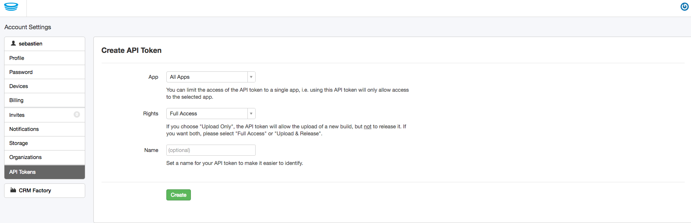

# Setup Project

1. Install node modules:

  ```
  npm install
  npm install -g plugman
  ```

2. Generate core files

  ```
  gulp setup
  ```

3. Watch and compile project files when files changed (if something wrong here, check if ruby/sass installed)

  ```
  gulp
  ```

4. Open server with livereload

  ```
  gulp serve
  ```

5. Build as webapp:

  ```
  gulp build --env {dev/qa/prod}
  ```

6. Setup Cordova project (testing and dev):

    ```
    gulp cordova:setup
    ```

# Building for iOS and Android

First of all, install fastlane (assuming Ruby is already installed)

```
gem install fastlane
```

[LOCAL only] Register you HockeyApp Api token in /fastlane/.env





The very first time, run:

```
fastlane ios project_name:{{projectName}} app_identifier:{{projectId}}

fastlane android
```

Why?: Running using gulp task is not interactive, that means it will not prompt credentials in order to remember then for the second time


PS: for credentials, please talk to your team lead or developers

4. Build and distribute as app:

  ```
  gulp cordova:all --env {dev/qa/prod}
  ```

# How to run it

1. install a Postman.
2. ask Jack for postman account, get access to create a login account of this app.
3. create access account in postman:find Enrollment in Colletions, change the mobileNumber value in POST body, click "send".
4. login with the mobileNumber you typed, and the OTP is 1234
